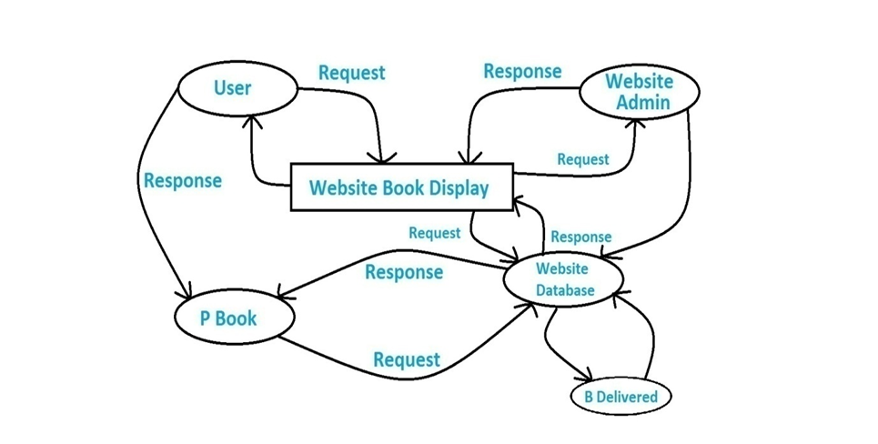
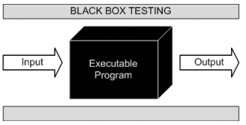
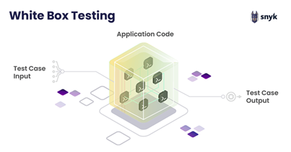
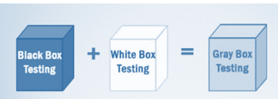

# 
FINAL THESIS

<b>Name:</b> Märcz Martin
<b>Class:</b> 13.D  

# 
 Bookstore Management System Documentation

## Table of Contents

1. [Introduction](#introduction)
    - [Project Background](#project-background)
    - [Objectives](#objectives)
    - [Scope](#scope)
    - [Applicability](#applicability)
2. [Requirements and Analysis](#requirements-and-analysis)
    - [Problem Description](#problem-description)
    - [Requirement Details](#requirement-details)
    - [Hardware Requirements](#hardware-requirements)
    - [Software Requirements](#software-requirements)
3. [System Design](#system-design)
    - [Comprehensive System Design](#comprehensive-system-design)
    - [Data Dictionary](#data-dictionary)
    - [Input/Output Design](#input-output-design)
4. [Testing and Implementation](#testing-and-implementation)
    - [Testing Methods](#testing-methods)
    - [Test Cases](#test-cases)
5. [Conclusion](#conclusion)
    - [System Limitations](#system-limitations)
    - [Future Development Opportunities](#future-development-opportunities)
    - [References](#references)

---

## Introduction

### Project Background

This project aims to develop software that allows administrators to efficiently manage book and customer data, providing quick access to information regarding book availability and customer records. The goal is to automate and digitalize bookstore management.

### Objectives

- Eliminate paper-based processes and digitize operations.
- Implement fast and accurate search functionalities to enhance operational efficiency.
- Store large volumes of data in a database.
- Simplify and automate the manual book purchasing process.

### Scope

The system aims to reduce labor costs and ensure accurate record-keeping. Additionally, it provides administrators with more flexible data management and easier access for users.

### Applicability

- Users can browse and purchase books anytime, from anywhere.
- Administrators can update book information within the system.
- The database ensures reliable and secure book record storage.

---

## Requirements and Analysis

### Problem Description

- Excessive paperwork.
- Lengthy processes.
- Higher costs due to manual record maintenance.
- Tedious and time-consuming manual data search.
- Slow and inaccurate manual operations.

### Requirement Details

The system includes two main modules:

1. **Admin Module**:
    - Manage book categories.
    - Add new books.
    - View customer messages.

2. **User Module**:
    - Browse books.
    - Add books to cart.
    - Search for books.

### Hardware Requirements

| Requirement         | Specification               |
|---------------------|-----------------------------|
| Operating System    | Windows 7/8/10, Linux, Mac  |
| RAM                 | Minimum 350MB               |
| Processor           | Dual-core or better         |

### Software Requirements

- WAMP Server
- MySQL
- PHPMyAdmin
- Browser (Firefox, Chrome, IE)

---

## System Design

### Comprehensive System Design

System design includes both **Physical Design** and **Database Design**. The primary design tools used are Data Flow Diagrams (DFD) and Entity-Relationship (ER) diagrams.

### Data Dictionary

| Table Name | Fields                        | Description                |
|------------|-------------------------------|----------------------------|
| Admin      | a_id, a_unm, a_pwd             | Admin login details         |
| Book       | b_id, b_nm, b_cat, b_desc, etc.| Detailed book information   |
| Category   | cat_id, cat_nm                 | Stores book category names  |

### Input/Output Design

The system provides user interfaces for the following pages:

- Homepage
- Login Page
- Book Details
- Cart Page

---

## Testing and Implementation

### Testing Methods

The following testing methods were applied:

1. **Black Box Testing**: Testing based on specifications.  

   

2. **White Box Testing**: Examining the code structure.  

   

3. **Gray Box Testing**: Testing with partial knowledge of the system’s internal structure.  

   

### Test Cases

**1. Admin Login Details**  
Username: Admin  
Password: Admin  
Expected Result:  
- If the fields are empty, an error message prompts to fill them in.  
- If the username or password is invalid, an error message is displayed requesting valid details. 

**2. User Login Details**  
Username: Dhaval  
Password: Dhaval  
Expected Result:  
- If the fields are empty, an error message prompts to fill them in.  
- If the username or password is invalid, an error message is displayed requesting valid details.  

**3. Registration Details**  
Username: EMPTY  
Password: EMPTY  
Full Name: EMPTY  
Security Answer: EMPTY  
Expected Result:  
- If the fields are empty, an error message prompts to fill them in.  
- If the username or password is invalid, an error message is displayed requesting valid details.  
- If the password is less than 8 characters, an error message is shown.

**4. Order Details**  
Full Name: Address: Contact Number: EMPTY  
Expected Result:  
- If the fields are empty, an error message prompts to fill them in.  
- If the contact number is not numeric, an error message is shown.

---

## Conclusion

### System Limitations

- There is no help feature currently available.
- The online payment option is missing.
- Multilingual support has not yet been implemented.
- Backup and recovery functions are not integrated.

### Future Development Opportunities

- Adding online payment and help modules.
- Implementing multilingual support.
- Enhancing the user experience with additional features.

### References

- Websites: Google, StackOverflow, W3Schools, Scribd.
- Sources: YouTube, Udemy.