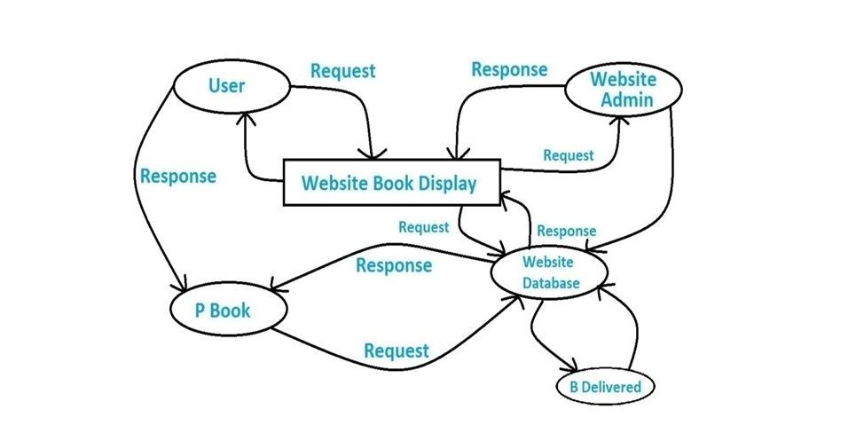
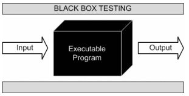
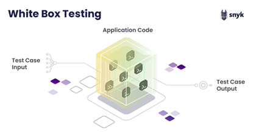
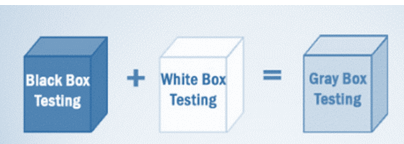
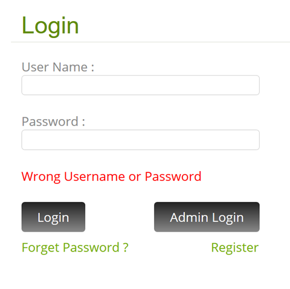
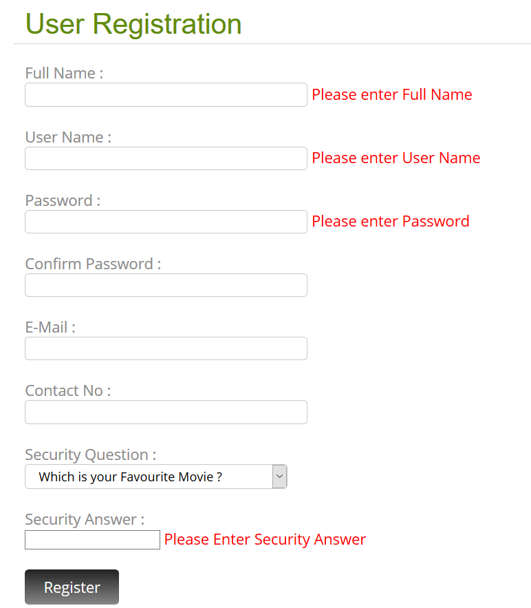

# 
ZÁRÓDOLGOZAT

<b>Név:</b> Märcz Martin
<b>Osztály:</b> 13.D  

# 
Könyvesbolt Menedzsment Rendszer Dokumentációja

## Tartalomjegyzék

1. [Bevezetés](#bevezetés)
    - [Projekt Háttér](#projekt-háttér)
    - [Célkitűzések](#célkitűzések)
    - [Hatókör](#hatókör)
    - [Alkalmazhatóság](#alkalmazhatóság)
2. [Követelmények és Elemzés](#követelmények-és-elemzés)
    - [Probléma Leírása](#probléma-leírása)
    - [Követelmények Részletezése](#követelmények-részletezése)
    - [Hardver Követelmények](#hardver-követelmények)
    - [Szoftver Követelmények](#szoftver-követelmények)
3. [Rendszer Tervezés](#rendszer-tervezés)
    - [Átfogó Rendszerterv](#átfogó-rendszerterv)
    - [Adatszótár](#adatszótár)
    - [Bemenet/Kimenet Tervezés](#bemenet-kimenet-tervezés)
4. [Tesztelés és Megvalósítás](#tesztelés-és-megvalósítás)
    - [Tesztelési Módszerek](#tesztelési-módszerek)
    - [Teszt Esetek](#teszt-esetek)
5. [Következtetés](#következtetés)
    - [Rendszer Korlátai](#rendszer-korlátai)
    - [Fejlődési Lehetőségek](#fejlődési-lehetőségek)
    - [Irodalomjegyzék](#irodalomjegyzék)

---

## Bevezetés

### Projekt Háttér

Ez a projekt célja egy szoftver létrehozása, amely lehetővé teszi az adminisztrátorok számára a könyv- és ügyféladatok könnyű kezelését, gyors hozzáférést biztosítva a könyvek és vásárlók információihoz. A cél a könyvesboltok menedzsmentjének automatizálása és digitalizálása.

### Célkitűzések

- A papíralapú folyamatok megszüntetése és digitalizációja.
- Gyors és pontos keresések megvalósítása a működési hatékonyság növelése érdekében.
- Nagy mennyiségű adat tárolása egy adatbázisban.
- A könyvvásárlás manuális folyamatának leegyszerűsítése és automatizálása.

### Hatókör

A rendszer célja, hogy csökkentse a munkaerő költségeit és biztosítsa a pontos nyilvántartást. Emellett az adminisztrátorok számára rugalmasabb adatkezelést, a felhasználók számára pedig egyszerűbb elérést biztosít.

### Alkalmazhatóság

- A felhasználók bármikor, bárhonnan böngészhetnek és vásárolhatnak könyveket.
- Az adminisztrátorok frissíthetik a könyvek adatait a rendszerben.
- Az adatbázis megbízható és biztonságos könyvnyilvántartást biztosít.

---

## Követelmények és Elemzés

### Probléma Leírása

- Túlzott papírmunka.
- Hosszadalmas folyamatok.
- Magasabb költségek a manuális nyilvántartások karbantartása miatt.
- Fárasztó és időigényes kézi adatkeresés.
- Lassú és pontatlan manuális műveletek.

### Követelmények Részletezése

A rendszer két fő modult tartalmaz:

1. **Admin Modul**:
    - Könyvkategóriák kezelése.
    - Új könyvek hozzáadása.
    - Ügyfélüzenetek megtekintése.

2. **Felhasználói Modul**:
    - Könyvek böngészése.
    - Könyvek kosárba helyezése.
    - Könyvek keresése.

### Hardver Követelmények

| Követelmény        | Specifikáció              |
|--------------------|---------------------------|
| Operációs Rendszer | Windows 7/8/10, Linux, Mac |
| RAM                | Minimum 350MB              |
| Processzor         | Kétmagos vagy jobb         |

### Szoftver Követelmények

- WAMP szerver
- MySQL
- PHPMyAdmin
- Böngésző (Firefox, Chrome, IE)

---

## Rendszer Tervezés

### Átfogó Rendszerterv

A rendszer tervezése magában foglalja a **Fizikai Tervezést** és az **Adatbázis Tervezést**. Az adatfolyam-diagramok (DFD) és az Entitás-Kapcsolat (ER) diagramok a fő tervezési eszközök.

### Adatszótár

| Tábla Név  | Mezők                         | Leírás                 |
|------------|-------------------------------|------------------------|
| Admin      | a_id, a_unm, a_pwd             | Admin bejelentkezési adatok |
| Könyv      | b_id, b_nm, b_cat, b_desc, stb.| Könyvek részletes adatai  |
| Kategória  | cat_id, cat_nm                 | Könyvkategóriák tárolása |

### Bemenet/Kimenet Tervezés

A rendszer biztosítja a felhasználói felületet a következő oldalakhoz:

- Főoldal
- Bejelentkezési oldal
- Könyv részletei
- Kosár oldal

---

## Tesztelés és Megvalósítás

### Tesztelési Módszerek

A következő tesztelési módszereket alkalmaztuk:

1. **Fekete Doboz Tesztelés**: Funkciók tesztelése specifikációk alapján.

2. **Fehér Doboz Tesztelés**: A kód struktúrájának vizsgálata.

3. **Szürke Doboz Tesztelés**: Részleges ismeretekkel a rendszer belső felépítéséről.

### Teszt Esetek

**1 Admin Bejelentkezési Adatok**  
Felhasználónév: Admin  
Jelszó: Admin  
Várt eredmény:  
- Ha a mezők üresek, akkor hibaüzenetet ad, hogy töltse ki a mezőket.  
- Ha a jelszó vagy a felhasználónév nem létezik, akkor hibaüzenetet ad érvényes adatok megadására.

**2 Bejelentkezési Adatok**  
Felhasználónév: Dhaval  
Jelszó: Dhaval  
Várt eredmény:  
- Ha a mezők üresek, akkor hibaüzenetet ad, hogy töltse ki a mezőket.  
- Ha a jelszó vagy a felhasználónév nem létezik, akkor hibaüzenetet ad érvényes adatok megadására.

**3 Regisztrációs Adatok**  
Felhasználónév: ÜRES  
Jelszó: ÜRES  
Teljes név: ÜRES  
Biztonsági válasz: ÜRES  
Várt eredmény:  
- Ha a mezők üresek, akkor hibaüzenetet ad, hogy töltse ki a mezőket.  
- Ha a jelszó vagy a felhasználónév nem létezik, akkor hibaüzenetet ad érvényes adatok megadására.  
- Ha a jelszó kevesebb mint 8 karakter, akkor hibaüzenetet ad.

**4 Rendelési Adatok**  
Teljes név: Cím: Kapcsolattartó szám: ÜRES  
Várt eredmény:  
- Ha a mezők üresek, akkor hibaüzenetet ad, hogy töltse ki a mezőket.  
- Ha a kapcsolattartó szám nem numerikus, akkor hibaüzenetet ad.
---

## Következtetés

### Rendszer Korlátai

- Jelenleg nincs súgó funkció.
- Az online fizetési lehetőség hiányzik.
- Többnyelvű támogatás még nem elérhető.
- Biztonsági mentés és helyreállítás funkciók nincsenek integrálva.

### Fejlődési Lehetőségek

- Online fizetési lehetőség és súgó funkció hozzáadása.
- Többnyelvű támogatás implementálása.
- A felhasználói élmény további bővítése új funkciókkal.

### Irodalomjegyzék

- Weboldalak: Google, StackOverflow, W3Schools. Scribd
- Források: YouTube, Udemy.
